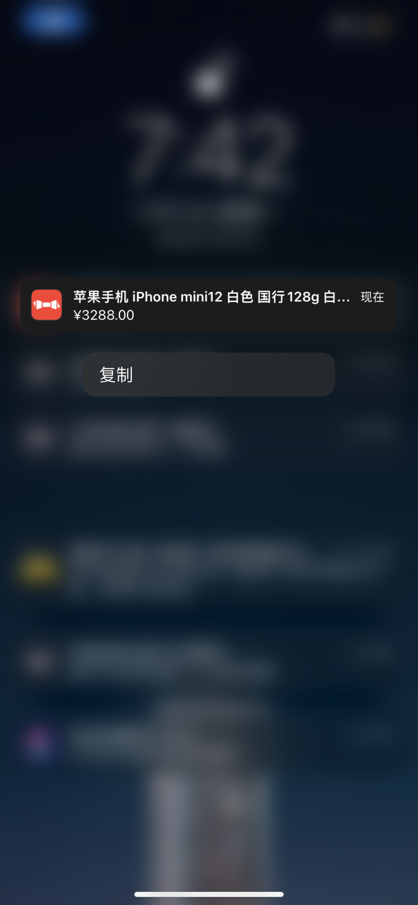
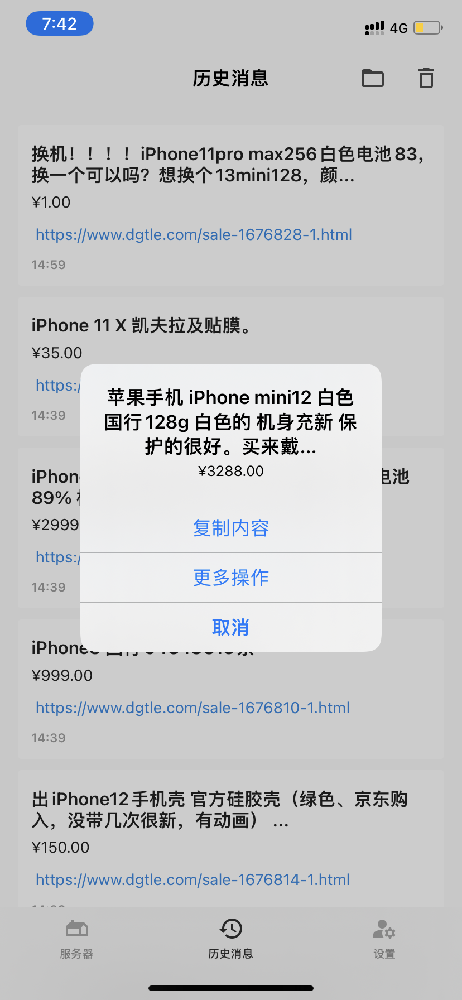
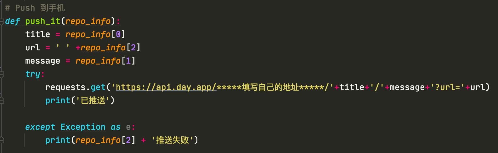

# price_monitor

用selenium对[数字尾巴二手区](https://www.dgtle.com/sale)的选定商品进行价格监测

监测新发布商品的标题，把选定商品通过Bark把消息push到手机。



电脑上也会打印出信息。


主程序 main.py 适用于Mac OS。

不想一直开着电脑的话，可以查看这篇文章[部署到Linux](https://juejin.cn/user/1451783954639693)。

./Windows内的main.py适用于Windows系统。

需要安装的第三方库：selenium、requests、simpleaudio

```
pip3 install requests
pip3 install selenium
pip3 install simpleaudio
```

iOS下载一个Bark，获取自己的推送地址，粘贴到代码里。





运行即可。


